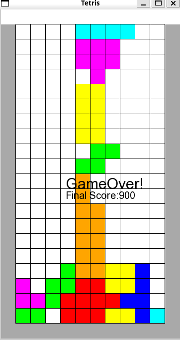

#テトリス

##インストール
```
git clone https://github.com/yusuke-0108/my-tetris.git
docker-compose build
docker-compose up -d
docker container exec -it {container name} bash
make
```

##操作方法

###Rで時計回りに回転
###矢印キーで下、左右方向に移動
###Escapeキーでゲーム終了

